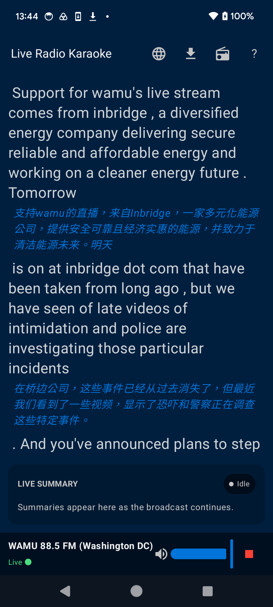
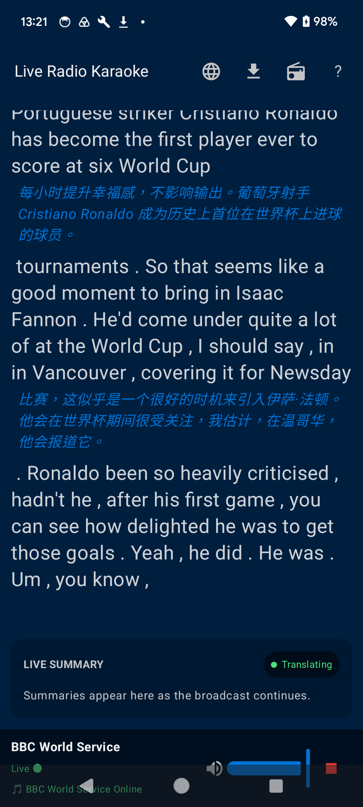
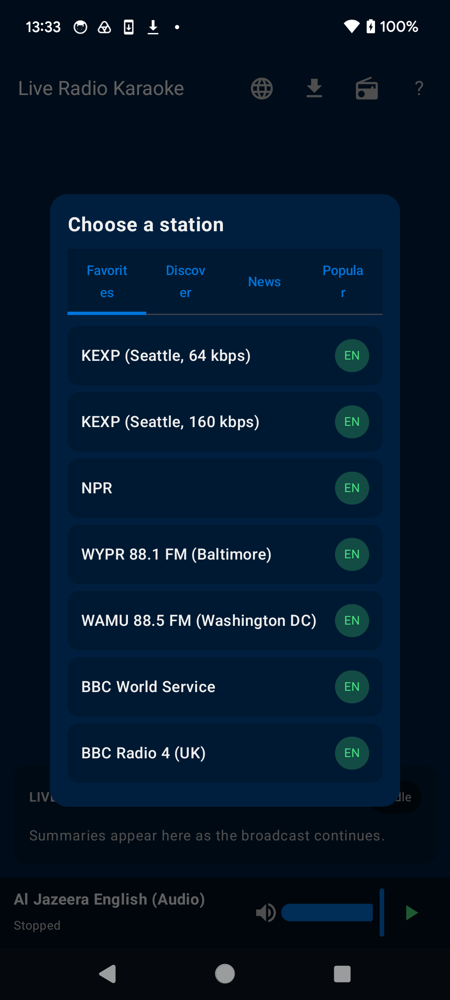
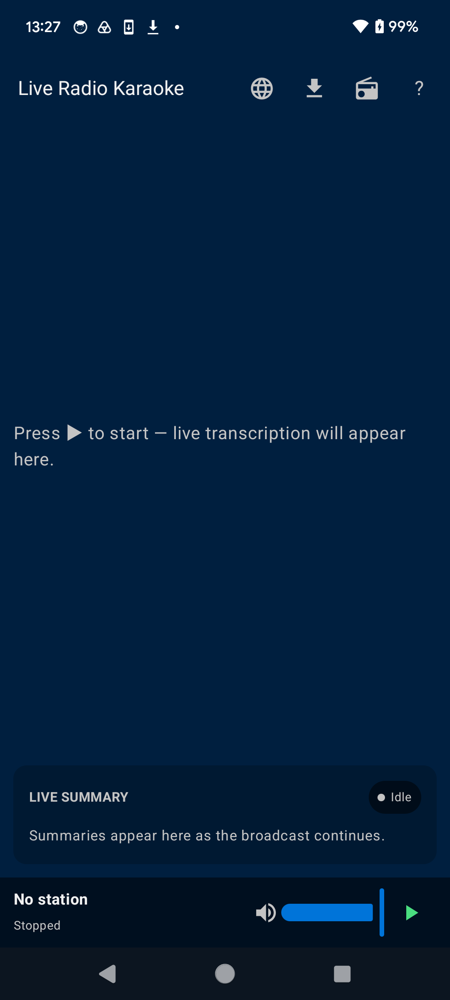

<div align="center">

# 📻 Live Radio Karaoke — Android

**Real-time radio transcription with karaoke highlighting, summaries and translation — running entirely on your phone.**

[](LICENSE)
[](https://github.com/vieenrose/live-radio-karaoke-android/releases/latest)
[-3DDC84.svg)](#install)




*Live English transcription with inline punctuation and parallel Chinese translation — verified on a Pixel 6.*

</div>

---

No server. No account. No tracking. Live Radio Karaoke streams a radio station and, **fully on-device**,
transcribes the speech word-by-word, highlights it karaoke-style in sync with the audio, and can
summarise and translate it live. A native Kotlin/Jetpack-Compose port of the original
[web app](https://huggingface.co/spaces/Luigi/Live-Radio-Karaoke), built for **F-Droid**.

<div align="center">
<table>
<tr>
<td></td>
<td></td>
<td></td>
</tr>
<tr>
<td align="center"><sub>Transcript + live translation</sub></td>
<td align="center"><sub>Stations & discovery</sub></td>
<td align="center"><sub>Home</sub></td>
</tr>
</table>
</div>

## Features

- 🎙️ **On-device speech recognition** (sherpa-onnx) — English, French and Mandarin, with code-switching and inline punctuation.
- ✨ **Karaoke highlighting** synced to playback, with an adjustable sync offset.
- 🌐 **Live translation** into 9 languages and **live summaries**, generated on-device by a small LLM (**Gemma 3 1B**, or a fully-open model you can choose).
- 📡 **35 bundled stations** + dynamic **discovery** via the Radio Browser directory.
- ⤓ **Export** the full transcript as SRT subtitles or plain text.
- 🔒 **Private by design** — all recognition and inference run locally; nothing is sent anywhere.

## Install

**1. Download the APK** (simplest) — grab the latest from
**[Releases](https://github.com/vieenrose/live-radio-karaoke-android/releases/latest)**, allow "install
unknown apps", and open it. arm64, Android 8.0+.

**2. Add the F-Droid repo** (auto-updates) — in F-Droid / Droid-ify, add:
```
https://vieenrose.github.io/live-radio-karaoke-android/repo
```

> On first launch the speech + language models download once and stay on your device. The summary/
> translation model is Google's **Gemma 3 1B** (non-free Gemma Terms) — downloaded only after in-app
> consent; a fully-open model can be chosen instead.

## Verified on real hardware

Tested on a **Pixel 6**: live English/French/Mandarin transcription, Chinese translation, http & https
stations, background-safe playback — all working. The screenshots above are straight from the device.

## How it works

Going on-device collapses the original web app's whole network layer — playback and ASR share one
decoded audio timeline in one process.

| Pipeline stage | Implementation |
|---|---|
| Radio fetch + decode + playback | AndroidX **Media3 / ExoPlayer** (+ HLS) |
| PCM tap → 16 kHz mono for ASR | custom pass-through `AudioProcessor` |
| Speech-to-text | **sherpa-onnx** streaming zipformer transducer |
| Summaries + translation | **llama.cpp** running **Gemma 3 1B** (one instance, serialized) |
| Karaoke sync | `withFrameNanos` loop over absolute token times |
| UI | Jetpack Compose (Material 3) |

## Performance (tuned for Pixel 6)

`libllama-android.so` is built with **ARMv8.2 + dotprod + fp16** (the Tensor SoC and essentially all
2018+ arm64 phones support these; the default NDK build leaves them off), markedly speeding up Gemma's
Q4 matmul. The summarizer/translator uses the device's performance cores; ASR runs in parallel on two
threads. Speech recognition is real-time with large headroom; the LLM runs comfortably for live
summaries and translation.

## Build from source (and the F-Droid story)

```bash
git clone https://github.com/vieenrose/live-radio-karaoke-android && cd live-radio-karaoke-android
./gradlew assembleDevDebug                       # audio-only / UI (no native AI) — fast
./scripts/fetch-native-libs.sh                   # llama.cpp + sherpa-onnx .so
./gradlew assembleDevDebug -PwithNative          # full on-device build
```

The **entire native stack builds from source** — onnxruntime v1.24.3, sherpa-onnx v1.13.3, llama.cpp —
and was made **offline- and blob-free-buildable** for F-Droid (onnxruntime's CMake FetchContent deps
are mirrored locally; its prebuilt host protoc is replaced by one built from source). Verified end-to-end
under network isolation. See **[`fdroid/`](fdroid/)** for the submission package and the build scripts in
**[`scripts/`](scripts/)**.

## Licensing

App code is **Apache-2.0**; all dependencies are FOSS and source-buildable. Models are downloaded at
runtime (never bundled), so the APK stays free — Gemma's non-free terms are gated behind in-app consent
with an Apache-2.0 alternative offered. F-Droid AntiFeature: `NonFreeNet`.

## Credits

Ports the architecture and station set of the original Live Radio Karaoke. sherpa-onnx Kotlin API
vendored from [k2-fsa/sherpa-onnx](https://github.com/k2-fsa/sherpa-onnx) (Apache-2.0).
